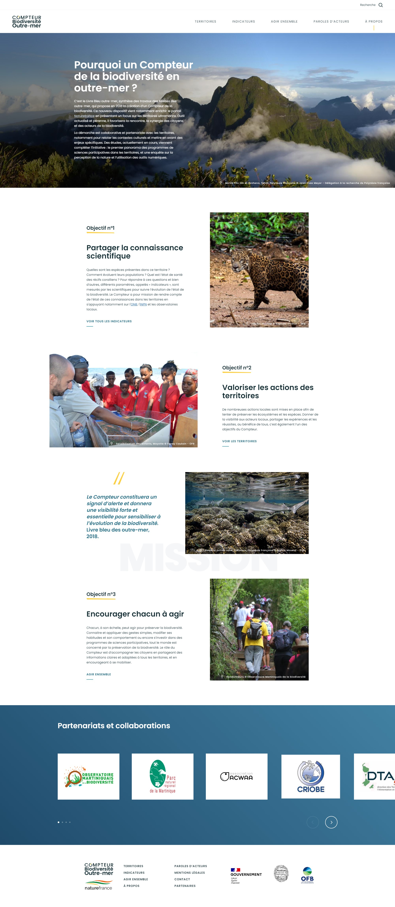

# S04E02 - Atelier

## Exercice 1 : Connaissance de la sémantique

Faites la liste de toutes les balises html connues, donnez votre score :

[https://codepen.io/plfstr/full/zYqQeRw](https://codepen.io/plfstr/full/zYqQeRw) 

## Exercice 2 : Conception

Créez le code HTML complet de cette page (balises HTML uniquement, pas de CSS). Vous pouvez laisser de côté le carrousel "Partenariats et collaborations" pour le moment. Pour les images, utilisez juste une balise ``.

## Exercice 3 : Hiérarchie des titres

Vérifiez avec Headingsmap la structure des titres des sites suivants. Est-elle cohérente ? Sinon, quelles sont les corrections à apporter ?

- [https://www.service-public.fr/](https://www.service-public.fr/)
- [https://www.thalesgroup.com/fr/newsroom](https://www.thalesgroup.com/fr/newsroom)
